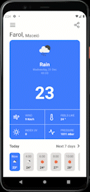

<h1 align="center">𝗪𝗲𝗮𝘁𝗵𝗲𝗿𝗔𝗽𝗽  </h1>
<p align="center">
A react native weather app, madde for a school project 😁
</p>

<div align="center">
  <a href="#technologies">Technologies</a>&nbsp;&nbsp;&nbsp;|&nbsp;&nbsp;&nbsp;
  <a href="#how-to-use">How To Use</a>
</div>
<br>

<div align="center">
  
</div>

>Status: Done ✅
<h2 id="technologies">💻 Technologies Used</h2>
<ul>
<li>React Native</li>
<li>Expo</li>
  
</ul><h2>📖 𝗨𝘀𝗲𝗱 𝗟𝗶𝗯𝗿𝗮𝗿𝗶𝗲𝘀/𝗣𝗮𝗰𝗸𝗮𝗴𝗲𝘀</h2>
<ul>
<li>React Native Vector icons</li>
<li>React Navigation</li>
<li>React Native View Shot</li>
<li>Expo Sharing</li>
</ul>

<h2>📡 𝗔𝗣𝗜𝘀 𝘂𝘀𝗲𝗱 𝗶𝗻 𝗮𝗽𝗽𝗹𝗶𝗰𝗮𝘁𝗶𝗼𝗻</h2><ul>
  <li><a href="https://openweathermap.org/api">OpenWeather API</a></li>
  <li><a href="https://docs.expo.dev/versions/latest/sdk/location/">Expo Location</a></li>
<li><a href="https://developers.google.com/maps/documentation/places/web-service/autocomplete">Google Places</a></li>
</ul>

<h2 id="how-to-use">📌 𝗛𝗼𝘄 𝗧𝗼 𝗨𝘀𝗲</h2>

```bash
# Clone this repository
$ git clone https://github.com/Eliezir/WeatherApp

# Go into the repository
$ cd WeatherApp

# Install dependencies
$ npm install

# Run the application
$ expo start
```

<sub>Made with 💜 by <a href="https://github.com/Eliezir">Eliezir Neto</a> </sub>
